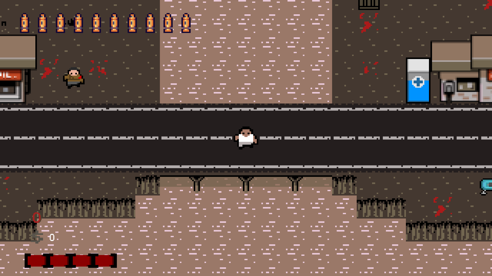
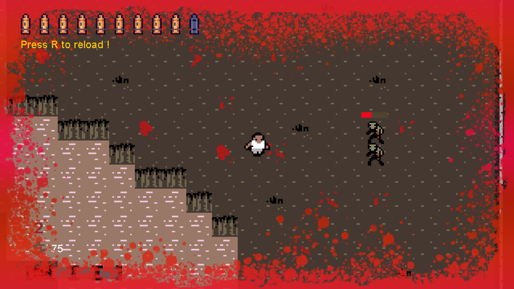

# One Man Army - 2D Java Game
A small 2D Java game inspired by Call Of Duty - Zombie Mode to learn and perform about OOP.

---
## Some Screenshot 📷
The player starts the game on the bridge.


A small screenshot when the player attacks the zombies.


---

## Features

- Home window
- Pregame window where all keys of the game are displayed.
- Fullscreen mode
- Map Loading
- Collision Map 
- Creation of custom Assets 
- Player management (life, move, update, ...)
- Interaction with NPCs and objects
- Trade Management
- Attack management
- Exponential zombie wave
- Zombie Pathfinding
- Easter Egg
- Weapon management (projectile, reloading, ...)
- Teleportation

---

## Deployment

To deploy and run this game :
- Go to /src/main/Main.java
- Run this file.

---

## Programming & OOP

This game was programmed in ```java``` to train in object-oriented programming.

---

## Authors & Contributor

- [@iamhmh](https://www.github.com/iamhmh)
- [@MelvynDenisEpitech](https://github.com/MelvynDenisEpitech)
- [@romdmr](https://github.com/romdmr)
